# About Me

- 화면 너머의 사용자가 느끼는 미세한 '불편함'과 '지루함'을 기술로 해결하는 것을 좋아합니다.

# Git Stats

# Algorithms

# Achievements

- **2025.08.18** · 숭실대학교 소프트웨어학부 **SW공모전 학장상** ***(2th)***
- **2024.06.25** · 2024-1학기 **성적 우수 장학생 *(석차 5/122, 평점 4.42)***
- **2025.10.11** · **2025 ICPC Seoul Regional 예선** *(70th, 교내 35팀 중 **4th**)*
- **2025.05.17** · 숭실대학교 교내 알고리즘 대회 **SCON 6th** — 숭실대학교
- **2024.11.22** · **2024 ICPC Seoul Regional 예선** *(110th, 교내 60팀 중 **7th**)*

# Experiences

- **2025.11.07–11.08** · **HACKY-TALKY 4기 해커톤** *(팀장)* — 상담 데이터 자동 기록 솔루션 (채널톡-노션 API 연동) 프론트엔드 개발
- **2025.08.15–08.18** · **UNITHON 교내 해커톤** *(팀장)* — 택시 공유 플랫폼 프론트엔드 개발
- **2025.11.01** · **2025 UNICON** — 강화학습 기반 AI 땅때먹기 게임 개발
- **2025.09.25–10.23** · **2025 사이드 임팩트 AI 트랙** — 청년 멘토링 플랫폼 풀스택 개발
- **2025.09.01–12.31** · **캡스톤디자인** *(팀장)* — AI 기반 식단 추천 서비스 프론트엔드 개발