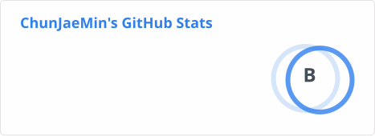
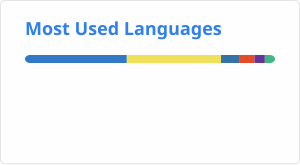

# About Me

- 단순한 구현을 넘어 팀 내 서비스를 깊이 이해하고, 적극적인 협업으로 비지니스 가치를 창출 할 수 있는 개발자가 목표입니다. 
- 개발에 들어가는 리소스들을 고려하여 합리적인 선택을 하고자 노력합니다.
- 다양한 분야의 아이디어를 접목하여 문제를 해결하는 것을 좋아합니다.

# Links

# Skills

### Frameworks

### Languages

### Architecture

# Achievements

- **2025.08.18** · 숭실대학교 소프트웨어학부 **SW공모전 학장상** ***(2nd)***
- **2024.06.25** · 2024-1학기 **성적 우수 장학생 *(석차 5/122, 평점 4.42)***
- **2025.05.17** · 숭실대학교 교내 알고리즘 대회 **SCON 동상**
- **2025.10.11** · **2025 ICPC Seoul Regional 예선** *(70th, 교내 35팀 중 **4th**)*
- **2024.11.22** · **2024 ICPC Seoul Regional 예선** *(110th, 교내 60팀 중 **7th**)*

# Experiences

- **2025.11.07–11.08** · **HACKY-TALKY 4기 해커톤** *(팀장)* — 상담 데이터 자동 기록 솔루션 프론트엔드 개발
- **2025.08.15–08.18** · **UNITHON 교내 해커톤** *(팀장)* — 택시 공유 플랫폼 프론트엔드 개발
- **2025.11.01** · **2025 UNICON** — 강화학습 기반 AI 땅때먹기 게임 개발
- **2025.09.25–10.23** · **2025 사이드 임팩트 AI 트랙** — 청년 멘토링 플랫폼 풀스택 개발
- **2025.09.01–12.31** · **캡스톤디자인** *(팀장)* — AI 기반 식단 추천 서비스 프론트엔드 개발

# Projects

- **Buquet-In (2025.11 ~ 12)**: OpenAPI 명세 기반의 병렬 개발 환경을 구축하고 , Netlify Proxy와 비동기 폴링을 통해 AI 부케 합성 기능을 안정화한 팀 프로젝트입니다.
- **도란도란 (2025.09)**: Whisper(STT)와 LLM, 벡터 임베딩을 이용한 AI 프로필 자동 생성 파이프라인을 구축하여 은퇴자-청년 매칭을 구현한 1인 풀스택 프로젝트입니다.
- **타다닥 (2025.08)**: UNITHON 해커톤 참가작으로, 해커톤 종료 직전 Node.js 기반 OCR 서버를 독자 구축하고 지도-리스트-캐러셀 간의 유기적인 상태 동기화를 구현했습니다.
- **Check Point (2025.07 ~ 08)**: 3-Page View Recycling과 더블 버퍼링 기술로 고성능 캘린더 엔진을 구축하여 SW 공모전 학장상을 수상한 급여 정산 플랫폼입니다.
- **Keep The Land! (2025.05 ~ 06)**: Unity ML-Agents의 PPO 알고리즘과 CNN+LSTM 레이어를 도입하여 최적의 영역 확보 전략을 학습시킨 강화학습 AI 땅따먹기 게임입니다.
- **IMU Runner (2024.11 ~ 12)**: Godot 엔진과 GLSL을 사용하여 3-Lane 이동 제어 시스템과 커스텀 쉴드 이펙트 쉐이더를 구현한 3D 무한 러닝 FPS 게임입니다.
- **시네마틱 디자인 포트폴리오 (2024.07 ~ 08)**: Three.js와 GLSL 커스텀 쉐이더를 활용해 아날로그 TV 노이즈 및 글리치 효과를 구현한 WebGL 기반 인터랙티브 웹 프로젝트입니다.
- **J-Chat (2024.02)**: WebSocket과 WebRTC 기술을 활용해 시그널링 서버를 구축하고 , STUN 서버 도입으로 NAT 환경을 극복한 실시간 N:N 화상 채팅 서비스입니다.
- **J-Shop (2023.12 ~ 2024.01)**: Next.js, MongoDB, AWS S3를 연동하여 인증부터 배포까지 전 과정을 경험한 커머스 풀스택 학습 프로젝트입니다.
- **J-Dashboard (2023.08 ~ 10)**: Vue 3의 컴포넌트 시스템과 Three.js 3D 렌더링, Riot API 연동을 통해 프레임워크의 기본기를 익힌 대시보드 프로젝트입니다.

# Git Stats

# Algorithms

